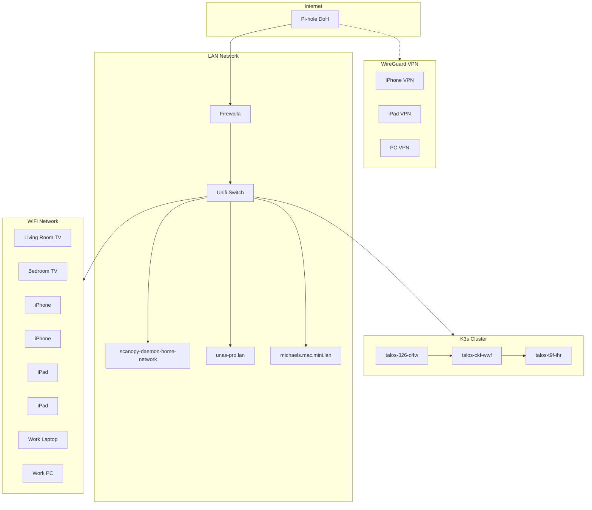

# Kube — Home Network Kubernetes Manifests

GitOps-ready Kubernetes manifests for my home lab, managed via **ArgoCD**.

---

## Overview

This repository contains Kubernetes manifests for self-hosted applications running on my **K3s cluster** (Talos-based nodes). All deployments are managed declaratively via GitOps — changes are applied by committing to this repo and letting ArgoCD sync.

---

## Cluster Architecture



---

## Nodes

| Hostname | Role | Notes |
|----------|------|-------|
| `talos-ckf-wwf` | Control plane | K3s server |
| `talos-t9f-ihr` | Worker | OpenClaw pinned here (has local storage) |
| `talos-326-d4w` | Worker | General workloads |

---

## ArgoCD Integration

### How It Works

1. **Commit** — Push manifest changes to this repo (e.g., update `Apps/openclaw/base/deployment.yaml`)
2. **ArgoCD detects** — Watches the repo for changes (default poll: 3 minutes)
3. **Sync** — Applies manifests to the cluster (`kubectl apply -k <app>/base`)
4. **Deploy** — Pods roll out with the new configuration

### App Structure

```
Apps/
├── openclaw/       # AI gateway (Discord, Telegram, etc.)
├── scanopy/        # Home network daemon
├── pairdrop/       # Local file sharing
├── arr-config/     # Plex/Arr suite config storage
├── radarr/         # Movie automation
├── sonarr/         # TV automation
├── prowlarr/       # Tracker indexer
├── jellyseerr/     # Content request UI
├── nginx-proxy-manager/  # Reverse proxy + SSL
├── gluetun/        # VPN tunnel for containers
├── minecraft/      # Game server
├── retroarch/      # Retro gaming
├── filezilla/      # FTP server
└── windows/        # Windows VM
```

Each app follows the **Kustomize** pattern:
```
<app>/base/
├── kustomization.yaml
├── namespace.yaml
├── pvc.yaml
├── deployment.yaml
└── service.yaml
```

---

## Storage

All persistent volumes use **Longhorn** for:
- Replication (3 copies across nodes)
- Snapshots (manual + scheduled)
- Backup to S3 (optional)

Example PVC:
```yaml
apiVersion: v1
kind: PersistentVolumeClaim
metadata:
  name: openclaw-data
spec:
  accessModes:
    - ReadWriteOnce
  storageClassName: longhorn
  resources:
    requests:
      storage: 10Gi
```

---

## Networking

### Ingress

- **nginx-proxy-manager** — Reverse proxy with Let's Encrypt SSL
- **NodePort** — Direct access via `<node-ip>:<nodePort>`

### DNS

- **Pi-hole** — Internal DNS + ad blocking (DoH upstream)
- All services accessible via `*.lan` domain

### VPN

- **WireGuard** — Remote access to cluster resources
- Split tunnel: only cluster traffic routed through VPN

---

## Deployment Workflow

### Manual (testing)
```bash
kubectl apply -k Apps/openclaw/base/
kubectl rollout restart deployment/openclaw -n openclaw-space
```

### ArgoCD (production)
```bash
# ArgoCD CLI
argocd app sync openclaw
argocd app wait openclaw --health

# Or via UI: https://argocd.<your-domain>/
```

---

## Secrets

Secrets are **not** committed to this repo. Create them manually:

```bash
# OpenClaw GitHub token
kubectl create secret generic openclaw-github -n openclaw-space \
  --from-literal=token=ghp_...

# OpenClaw gateway token
kubectl create secret generic openclaw-secrets -n openclaw-space \
  --from-literal=OPENCLAW_GATEWAY_TOKEN=$(openssl rand -hex 32)
```

For production, consider **SealedSecrets** or **External Secrets Operator** to encrypt secrets in Git.

---

## Portfolio Site

This repo has a **GitHub Pages** site showcasing select apps:

**https://mentholmike.github.io/kube/**

Featured: Longhorn, Windows VM, PairDrop, Minecraft (clean, interview-ready docs).

