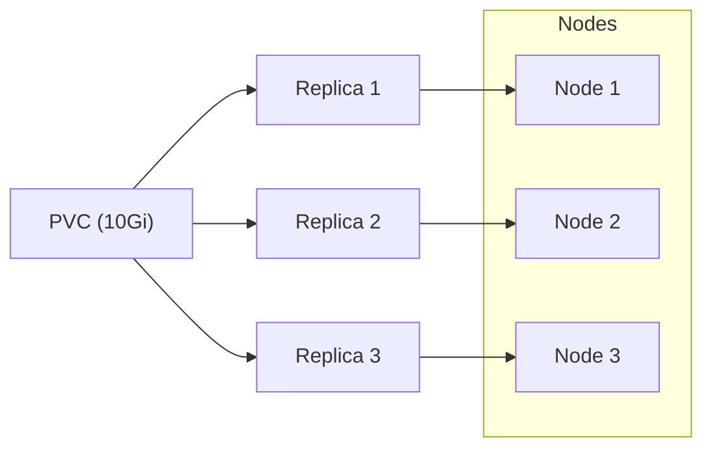

# Longhorn Storage

**Cloud-native distributed block storage** for Kubernetes.

---

## Overview

Longhorn provides **replicated persistent volumes** for your K8s cluster:

- 3 copies across nodes (HA)
- Incremental backups to S3
- Built-in snapshot + restore
- Simple UI for management

---

## Why Longhorn?

### Problem Solved

K8s pods are ephemeral — when they die, their data dies. Longhorn solves this:

```
Before: Pod dies → PVC data lost
After:  Pod dies → PVC survives, new pod reattaches
```

### How It Works



Each PVC has 3 replicas on different nodes — if one node dies, data survives.

---

## Install

Longhorn is installed as a **system component** (not in `Apps/`):

```bash
# Install via Helm
helm repo add longhorn https://charts.longhorn.io
helm install longhorn longhorn/longhorn --namespace longhorn-system --create-namespace

# Or via kubectl
kubectl apply -f https://raw.githubusercontent.com/longhorn/longhorn/v1.7.0/deploy/longhorn.yaml
```

---

## Usage in Manifests

### Example PVC

```yaml
apiVersion: v1
kind: PersistentVolumeClaim
metadata:
  name: openclaw-data
spec:
  accessModes:
    - ReadWriteOnce
  storageClassName: longhorn
  resources:
    requests:
      storage: 10Gi
```

### Key Settings

| Setting | Value | Notes |
|---------|-------|-------|
| `storageClassName` | `longhorn` | Uses Longhorn provisioner |
| `accessModes` | `ReadWriteOnce` | Single node attach (typical) |
| `replicas` | `3` | Default in Longhorn settings |

---

## Access the UI

After install, port-forward or expose via ingress:

```bash
# Quick access (terminal)
kubectl -n longhorn-system port-forward svc/longhorn-frontend 8080:80

# Or via ingress (production)
https://longhorn.yourdomain.com
```

UI features:
- Volume management (create, delete, snapshot)
- Backup configuration (S3 credentials)
- Node health monitoring
- Engine image upgrades

---

## Backup to S3

Configure S3 backup in Longhorn settings:

```yaml
# In Longhorn UI: Settings → Backup
endpoint: s3.us-east-1.amazonaws.com
bucketName: longhorn-backups
accessKey: <your-key>
secretKey: <your-secret>
```

Then create scheduled backups:
```yaml
# In Volume settings
Backup: Enabled
Schedule: 0 2 * * *  # Daily at 2 AM
```

---

## Lessons Learned

**What worked:** Longhorn is production-ready — simple, reliable, great UI.

**What I'd improve:**
- Enable **encryption** at rest (LUKS)
- Set up **S3 backup** immediately (don't wait for disaster)
- Tune **replica count** based on node count (3 for 3+ nodes, 2 for 2 nodes)

---

## Related

- [Windows VM](windows.md) — Uses Longhorn for 75Gi PVC
- [Minecraft](minecraft.md) — Uses hostPath instead (contrast)
