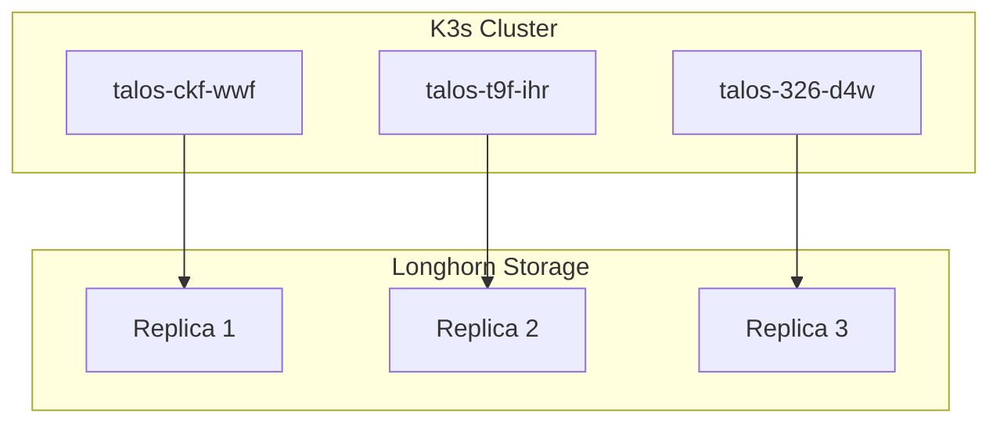

<script src="https://cdn.jsdelivr.net/npm/mermaid@10/dist/mermaid.min.js"></script>
<script>mermaid.initialize({startOnLoad:true,theme:'dark'});</script>

# Home Lab Kubernetes

**GitOps-managed K3s cluster** running on Talos-based nodes with Longhorn storage.

This site showcases a subset of my home lab infrastructure — production-ready manifests for common self-hosted applications.

---

## ArgoCD CI/CD Pipeline

All deployments are managed via **ArgoCD** — GitOps-style continuous delivery.

### Pipeline Flow

```
Developer → Git Commit → ArgoCD Detects → Sync → K3s Cluster
```

### 1. Commit Changes
```bash
# Edit manifests
vim Apps/pairdrop/base/deployment.yaml

# Commit & push
git add -A && git commit -m "Update PairDrop config"
git push origin main
```

### 2. ArgoCD Auto-Sync
- Polls repo every 3 minutes
- Detects changes in `main` branch
- Applies manifests: `kubectl apply -k Apps/pairdrop/base/`
- Rolls out deployment

### 3. Verify Deploy
```bash
# Watch rollout
kubectl rollout status deployment/pairdrop -n pairdrop-space

# Or via ArgoCD UI
https://argocd.k3s.wagmilabs.fun
```

### Manual Deploy (Testing)
```bash
kubectl apply -k Apps/pairdrop/base/
kubectl rollout restart deployment/pairdrop -n pairdrop-space
```

---

## Featured Apps

### Storage & Infrastructure
- **[Longhorn](apps/longhorn.md)** — Cloud-native distributed block storage
- **[Windows VM](apps/windows.md)** — Windows 11 VM via KubeVirt

### Applications
- **[PairDrop](apps/pairdrop.md)** — Local file sharing (AirDrop alternative)
- **[Minecraft](apps/minecraft.md)** — Minecraft server with K8s management

---

## Cluster Architecture



---

## Tech Stack

| Component | Technology |
|-----------|------------|
| **Orchestrator** | K3s (Kubernetes lightweight) |
| **Nodes** | Talos Linux (immutable OS) |
| **Storage** | Longhorn (cloud-native block storage) |
| **GitOps** | ArgoCD (declarative sync) |
| **Ingress** | nginx-proxy-manager (reverse proxy + SSL) |
| **VPN** | WireGuard (remote access) |

---

## Why This Architecture?

### Design Decisions

1. **GitOps Workflow** — All changes via Git commits, auditable and versioned
2. **Immutable Nodes** — Talos Linux reduces attack surface, no SSH
3. **Replicated Storage** — Longhorn provides 3 copies across nodes
4. **Declarative Config** — Kustomize for DRY manifests

### Trade-offs

| Benefit | Trade-off |
|---------|-----------|
| Reproducible deploys | Learning curve for K8s |
| High availability | Resource overhead |
| Easy rollback | Complexity for simple workloads |

---


---

## Contact

**Repo:** [github.com/mentholmike/k3s](https://github.com/mentholmike/k3s)  
**Domain:** [k3s.wagmilabs.fun](https://k3s.wagmilabs.fun)  
**LinkedIn:** [Michael Wyatt](https://www.linkedin.com/in/michael-wyatt-526918125)

*This is a personal home lab — not for production use without review.*
