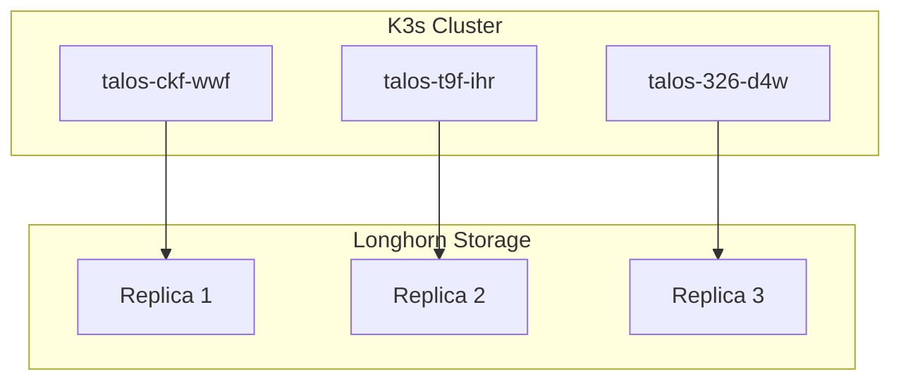

# Home Lab Kubernetes

**GitOps-managed K3s cluster** running on Talos-based nodes with Longhorn storage.

This site showcases a subset of my home lab infrastructure — production-ready manifests for common self-hosted applications.

---

## Quick Start

```bash
# Clone the repo (private access required)
git clone git@github.com:mentholmike/kube.git
cd kube

# Deploy an app
kubectl apply -k Apps/pairdrop/base/
kubectl apply -k Apps/minecraft/base/
```

---

## Featured Apps

### Storage & Infrastructure
- **[Longhorn](apps/longhorn.md)** — Cloud-native distributed block storage
- **[Windows VM](apps/windows.md)** — Windows 11 VM via KubeVirt

### Applications
- **[PairDrop](apps/pairdrop.md)** — Local file sharing (AirDrop alternative)
- **[Minecraft](apps/minecraft.md)** — Minecraft server with K8s management

---

## Cluster Architecture



---

## Tech Stack

| Component | Technology |
|-----------|------------|
| **Orchestrator** | K3s (Kubernetes lightweight) |
| **Nodes** | Talos Linux (immutable OS) |
| **Storage** | Longhorn (cloud-native block storage) |
| **GitOps** | ArgoCD (declarative sync) |
| **Ingress** | nginx-proxy-manager (reverse proxy + SSL) |
| **VPN** | WireGuard (remote access) |

---

## Why This Architecture?

### Design Decisions

1. **GitOps Workflow** — All changes via Git commits, auditable and versioned
2. **Immutable Nodes** — Talos Linux reduces attack surface, no SSH
3. **Replicated Storage** — Longhorn provides 3 copies across nodes
4. **Declarative Config** — Kustomize for DRY manifests

### Trade-offs

| Benefit | Trade-off |
|---------|-----------|
| Reproducible deploys | Learning curve for K8s |
| High availability | Resource overhead |
| Easy rollback | Complexity for simple workloads |

---

## Lessons Learned

### What Worked Well
- **Longhorn** — Simple, reliable, built-in backup to S3
- **Talos** — Minimal maintenance, no OS patching
- **ArgoCD** — Visual sync status, easy rollback

### What I'd Do Differently
- Start with **vanilla K8s** before Talos (steeper learning curve)
- Use **SealedSecrets** earlier (encrypt secrets in Git)
- Implement **network policies** sooner (zero-trust networking)

---

## Contact

**Repo:** [github.com/mentholmike/k3s](https://github.com/mentholmike/k3s)  
**Domain:** [k3s.wagmilabs.fun](https://k3s.wagmilabs.fun)

*This is a personal home lab — not for production use without review.*
